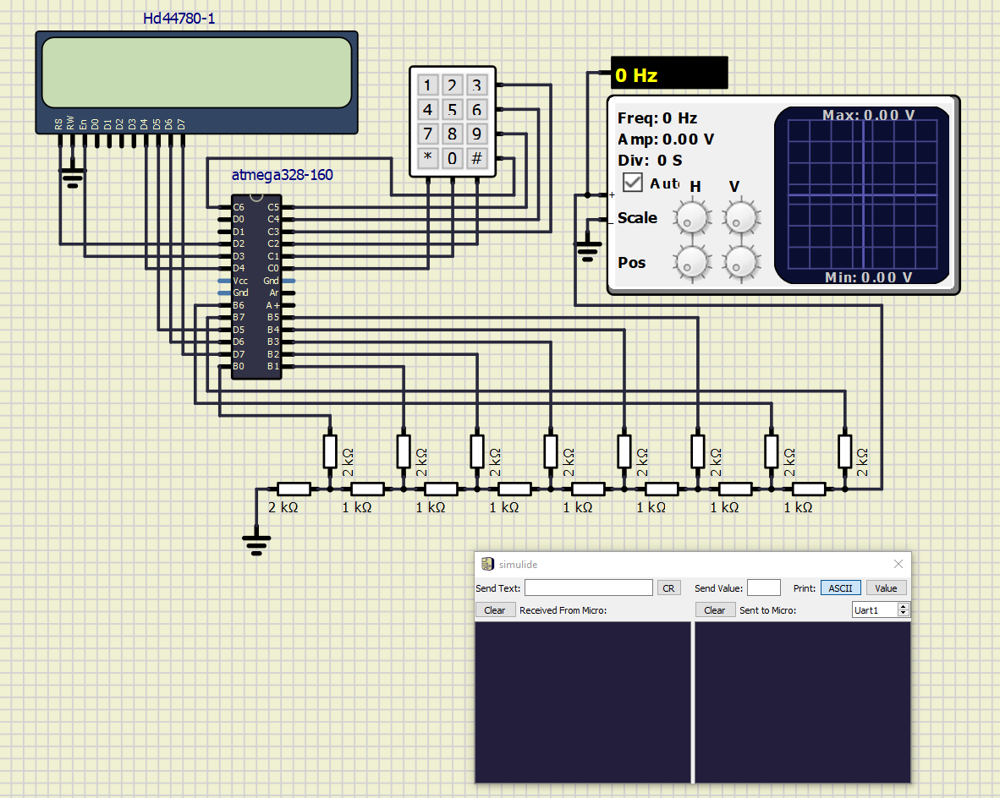
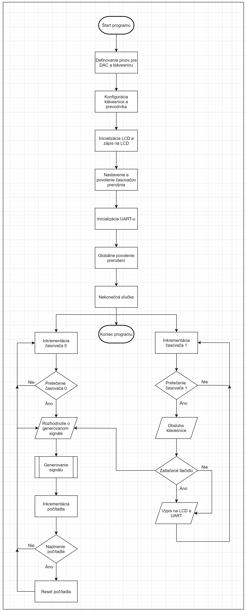

# R-2R digtálno-analógový prevodník

### Zadanie

Popis funkcie R-2R digitálno-analógového prevodníku (DAC). Aplikácia generátoru analógového signálu využívajúci 8bitový DAC. 6 prednastavených typov signálu. Ovládanie pomocou klávesnice 4x3. Zobrazovanie informácií na displeji. Odosielanie informácií o stave aplikácie na UART. 

## Popis hardwaru

Použitý hardware:
Mikrokontrolér ATmega328P
Displej HD44780 2x16 znakov
Klávesnica 4x3
8-bitový R-2R D/A prevodník 
Mikrokontrolér obsahuje program, ktorý bude generovať signál na výstupe externého D/A prevodníka takého tvaru, aký si používateľ zvolí podľa čísla na klávesnici. 
Displej zobrazuje informáciu o tom, aký signál je generovaný mikrokontrolérom na výstupe externého D/A prevodníka.
Klávesnica funguje ako maticová, na výstupe mikrokontroléra sa generuje testovací signál privádzaný na klávesnicu a na vstupe do mikrokontroléra z klávesnice sa skenuje prichádzajúca postupnosť bitov. Vysoká úroveň indikuje stlačené tlačidlo. Toto sa opakuje v nekonečnej sľučke.
R-2R D/A prevodník prevádza 8-bitovú postupnosť 2 hodnôt napätia 0V a 5V na 256 hodnôt napätia na jeho výstupe v rozmedzí 0-5V pomocou odporovej siete R-2R.

## Popis zdrojového kódu a simulácie

[Link na adresár projektu na GitHube](https://github.com/NechTaSilaSprevadza/Digital-electronics-2/tree/master/Labs/project)

### Schéma zapojenia

### Vývojový diagram

### Popis zdrojového kódu
*tu bude popis kodu*

## Video
Video - [na stiahnutie](Video/Video.mp4)
Video - [na pozretie](https://drive.google.com/file/d/1nHFWSgAs_humQwwQS_2yR3hbuxNF-2Kv/view?usp=sharing)

## Referencie

1. [Príncíp fungovania R-2R D/A prevodníka](https://www.electronics-tutorials.ws/combination/r-2r-dac.html)
2. [Look-up tabuľka funkcie sínus](https://gist.github.com/funkfinger/965900)
3. [Aplikácia na tvorbu vývojového diagramu](https://app.diagrams.net/)
